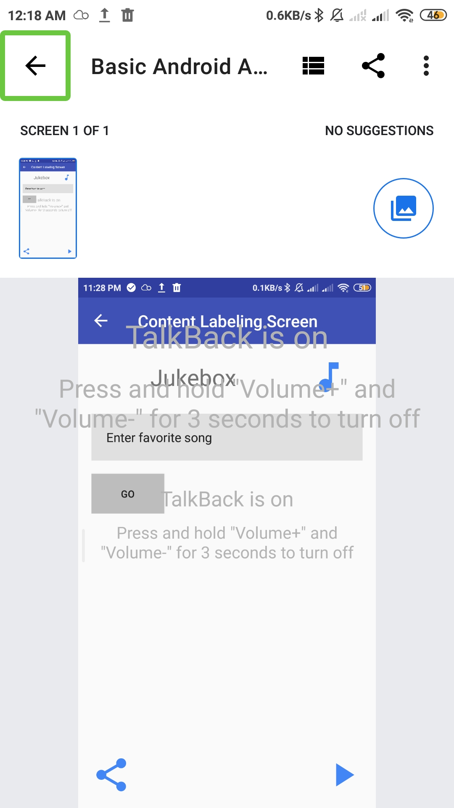

# Android-Studio-Sprints-NAID
 This repositery show my implementations of  android studio projects with Sprints and NAID


<!--   -->
<p align="center">
  
     
   
  
</p>


## About the Project

This Project is part of the NAID Mobile App Internship hosted and managed by Sprints concerning `Building an app with ease accessability to PWDs`.
<p align="center">
  
</p>


**[1] Content Labeling**
```
When a user with vision impairment tries to navigate an application by touch, TalkBack announces all actionable content as long as it has meaningful, useful, and descriptive labels. If such labels are missing, TalkBack may not be able to properly explain the function of a particular control to a user. In some cases, TalkBack may skip over some content entirely.
```
The best practices for labeling content in an accessible manner can be summarized as follows:

1. Keep content brief(limited to 40-character).

2. Don't include words that describe how users should physically interact (e.g. click, tap, press) with your controls in your content description. 

3. Have the most semantically important information come first in your content label. This way, if users don't need or want to hear the rest, they can mute audio feedback.

> The left image `Using Accessibility Scanner` show 2 suggestions for content labeling on **share** and **play & pause** buttons.\
> The image on the right show no suggesstions after fixing the labeling.

<p align="center">
  
  
</p>

**[2] Content Grouping**
```
Sometimes the auditory feedback TalkBack gives for visual elements in an app may not reflect their logical and spatial structure. Even though elements may be ordered in a sensible way visually, they may be spoken out of order.
```
The best practices for grouping and ordering elements in an accessible manner can be summarized as follows:

- The view hierarchy order and on-screen positioning determine grouping and ordering of text in spoken feedback.
- You should group non-focusable items in a focusable container to have them read as a single item.
- To logically group related items, it is sometimes necessary to create nested ViewGroup elements.
> The left image `Using Accessibility Scanner` show no suggestions for content labeling on, but there is adjustment that should be made for ease of use(instead of swiping 6 times to hear all the content of `song details` we can groub the labels related to each other)\
> The image on the right show no suggesstions also after fixing the content grouping but we here noticed the grouping is correctly managed(see the green focus box surround corresponding text views).

<p align="center">
  
  
</p>

**[3] Live Region**\
When you focus on a radio button and double-tap to select it, TalkBack announces the changed button state and also gives you feedback about whether you were right or not ("Incorrect. Checked", or "Correct! Checked", for example).
<p align="center">
  
</p>

**[4] Larger Touch Targets**\
Tooling and layout bounds: Enable developer options by going to Settings > System > Developer Options. Under the Drawing category, find "Show layout bounds" and turn it on. Your screen should now show the clip bounds, margins, etc. of every visible view.

> The left image `Using Layout Boundaries` show small area for touching action which may be disturbuing for people with motoe disabilities or people with large hands.\
> The image on the right show the touchable area after adjustment.

<p align="center">
  
  
</p>

**[5] Ensuring Adequate Color Contrast**\
Users with low vision can't read information on a screen if there is not enough contrast between the foreground and background. Low contrast ratios between foreground and background colors can cause views to blur together for some users, while high contrast ratios makes them stand out more clearly. Different lighting situations can amplify the problems created by low contrast ratios.

> The left image `Using Layout Boundaries` show small area for touching action which may be disturbuing for people with motoe disabilities or people with large hands.\
> The image on the right show the touchable area after adjustment.

<p align="center">
  
  
</p>

## Prerequisites

A good Understanding of **Java**, **OOP**  and one of its GUI Components (Android Studio)\
However, you can apply the concepts of the projects with any other prefered programming language.

- Accessibility Scanner App

## Projects List

|  # |                                       Project Name                                       |          Status          |
|:--:|:----------------------------------------------------------------------------------------:|:------------------------:|
| 01 | [LoginForm Design with Linear Layout](https://github.com/mohamed-abdelaziz721/Login-Form) |    :heavy_check_mark:    |
| 02 |          [Relative Layout](https://github.com/mohamed-abdelaziz721/Relative-Layout)          |    :heavy_check_mark:    |
| 03 |          [Constraint Layout](https://github.com/mohamed-abdelaziz721/Constraint-Layout)              |    :heavy_check_mark:    |
| 04 | [Navigation Throught Activities](https://github.com/mohamed-abdelaziz721/Navigation-Throught-Activities)              |    :heavy_check_mark:    |
| 05 | [Accessibility App](https://github.com/mohamed-abdelaziz721/Accessibility-App)              |    :heavy_check_mark:    |


## Supervision
Eng. Nourhan Gehad - Sprints - NAID

Eng. Mohamed Hefney - Sprints - NAID
